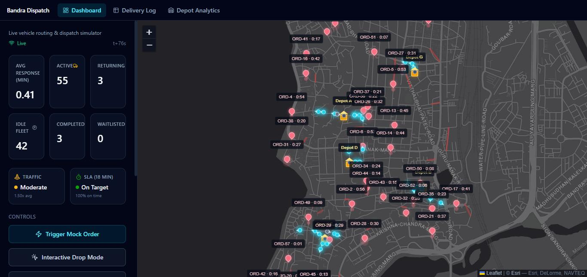

# Bandra Dispatch

A real-time **vehicle routing & dispatch simulator** for a delivery fleet operating on the actual street network of Bandra, Mumbai. 100 vans across 7 depots serve a live stream of orders, with congestion-aware routing, a depot capacity constraint, and a running cost model — all visualised on a live map.



## What it does

- **Real road network.** The drivable street graph is pulled from OpenStreetMap via OSMnx (one-ways, dead ends, per-edge speed limits). Vans move continuously along real road geometry, not node-to-node.
- **Live traffic.** Every road segment has its own oscillating congestion wave (up to 2.6× slowdown). The same live weight drives both dispatch decisions and van speed.
- **Optimal dispatch.** Each depot solves an assignment problem (idle vans × pending orders) with the Hungarian algorithm on congestion-aware travel times.
- **Logistics constraints.** Depots have a cap on active orders; overflow is waitlisted and triggers a restock cooldown that costs money.
- **Cost accounting.** Fixed costs (warehouse, utilities, drivers, maintenance) plus variable costs (₹/km fuel including empty return legs, restock charges), tracked live per delivery, per depot and globally.
- **SLA tracking.** On-time % against an 18-minute target, plus backlog and ETA estimates. Built to show the system degrading honestly under load rather than hiding the backlog.
- **Stress testing.** Queue up to 300 orders that are injected one per second and watch the backlog build and drain.

## Interesting engineering problems

**Balanced depot placement.** Picking depot locations turned out to be harder than it looks. Straight-line farthest-point seeding gave badly uneven depots — one depot "owned" 39% of the network, another 1.8% — because geometric spread is not the same as reachability on a real street layout. The fix has three parts:

1. Seed with farthest-point sampling using real **road travel time** (Dijkstra), not lat/lon distance.
2. Assign nodes with a **regret-based capacitated greedy** (nodes with the strongest single preference claim their depot first) so no depot exceeds its share.
3. Refine with **Lloyd's iteration**: re-centre each depot on its own partition, then re-balance.

Measured on the real network with 7 depots: re-centring cut the **average node-to-depot travel time from 189.8 s to 82.5 s** (max 640 s → 325 s) and removed a depot that had been stranded with 13 of 1,086 nodes. Node splits per depot went from `[179, 179, 179, 179, 179, 13, 178]` to `[97, 179, 170, 135, 179, 172, 154]` (figures cover the nodes reachable from their assigned depot; see `SIMULATION_LOGIC.md` §4 for the full comparison and known limitations).

**Decomposed multi-depot VRP.** Rather than one global assignment, orders are partitioned by home depot and each depot runs one Dijkstra plus one Hungarian solve per tick — 7 shortest-path searches per tick instead of up to 100 (one per idle van).

**Silent-failure debugging.** A one-way-street edge case (a directed return path that doesn't exist even though the outbound one did) crashed the fire-and-forget tick loop *silently* — the API kept answering while the simulation had stopped advancing. It's now handled with an undirected fallback and a guarded loop; the story is written up in the docs so it isn't rediscovered.

The full design — physics, formulas, algorithms, known edge cases — is in [`SIMULATION_LOGIC.md`](SIMULATION_LOGIC.md).

## Tech stack

| Layer | Tech |
|---|---|
| Backend | Python, FastAPI, WebSockets, NetworkX, SciPy (`linear_sum_assignment`), OSMnx, NumPy |
| Frontend | React 19, Vite, Tailwind CSS 4, react-leaflet |
| Data | OpenStreetMap (Bandra, Mumbai drivable network, cached as GraphML) |

## Running it locally

**Prerequisites:** Python 3 and Node.js 20.19+ (or 22.12+, as required by Vite 8). Developed and tested on Python 3.14 and Node 24.

```bash
# Backend
cd backend
python -m venv venv
venv/Scripts/activate        # Windows  (macOS/Linux: source venv/bin/activate)
pip install -r requirements.txt

# Frontend
cd ../frontend
npm install
```

Then start both servers from the repo root:

```bash
./start.sh        # macOS / Linux / Git Bash
.\start.ps1       # Windows PowerShell
```

- Frontend: <http://localhost:5174>
- Backend API: <http://localhost:8000> (interactive docs at `/docs`)

The street network ships in `backend/data/bandra_mumbai.graphml`, so the first start doesn't need to download anything from OpenStreetMap.

## API

| Endpoint | Purpose |
|---|---|
| `GET /api/state` | Full snapshot: depots, vehicles, open orders, metrics, top congested segments, recent deliveries |
| `GET /api/metrics` | Tick, SLA %, costs, backlog / ETA |
| `GET /api/deliveries` | Delivery log |
| `GET /api/depots` | Per-depot analytics |
| `POST /api/orders` | Create an order at `{lat, lon}` |
| `POST /api/orders/mock` | Create one random order |
| `POST /api/orders/bulk` | Queue `{count}` orders (max 300), injected 1 per second |
| `POST /api/reset` | Reset the simulation |
| `WS /ws/simulation` | Live push channel the UI subscribes to for per-tick updates |

## Repository layout

```
backend/
  app/            FastAPI app, simulation loop, dispatch, routing, traffic, state
  data/           Cached Bandra street network (GraphML)
frontend/src/     React app: map, dashboard, delivery log, depot analytics
reports/          Stress-test report
SIMULATION_LOGIC.md   Design reference: constraints, formulas, algorithms, gotchas
```

## Status

Personal project. Fleet is currently 100 vans / 7 depots / 18-minute SLA. Stress-test capacity figures in `SIMULATION_LOGIC.md` §10 were measured at the earlier 50-van / 5-depot scale and haven't been re-measured at the current size.
